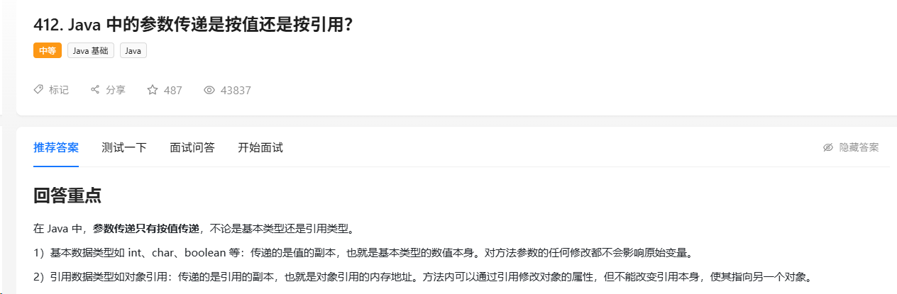
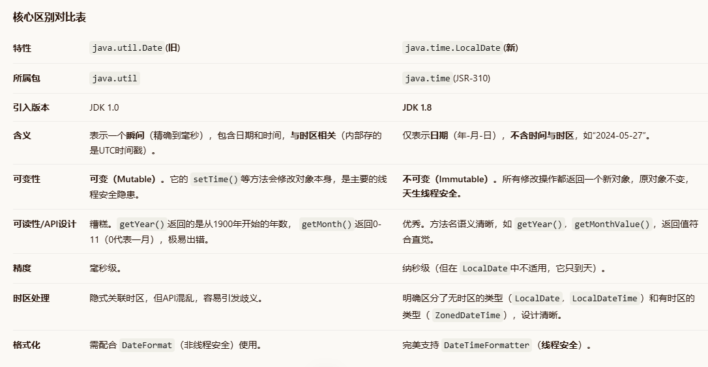

# java 基础

## 序列化与反序列化

1. 必须实现Serializable[ˈsɪərɪəlaɪzəbl]接口, 这是序列化的凭证
2. 字段加了transient[ˈtrænʃnt]属性就会跳过序列化(例如密码等属性)

面试官追问

提问：transient 和 static 修饰的字段都不会被序列化，它们有什么区别？

回答：本质不同。static 字段属于类，压根就不是对象状态的一部分，所以不存在“序列化不序列化”的问题，它就不在序列化的范畴内。transient 是专门告诉序列化机制“这个实例字段我不想存”，比如密码、缓存这类不适合持久化的数据。一个是“不归你管”，一个是“归你管但我不让你存”。

提问：如果父类没有实现 Serializable，子类实现了，序列化子类对象时父类的字段会怎样？

回答：父类字段不会被序列化。反序列化时，子类字段正常恢复，但父类字段会调用父类的无参构造器重新初始化。如果父类没有无参构造器，反序列化直接报错。所以如果父类字段也参与序列化，父类也得实现 Serializable。

提问：Externalizable 接口和 Serializable 有什么区别？

回答：Serializable 是自动序列化，JDK 帮你搞定所有字段。Externalizable 是手动挡，必须自己实现 writeExternal 和 readExternal 方法，一个字段一个字段地写出去、读进来。好处是完全可控，可以做定制优化；坏处是麻烦，漏写一个字段就丢数据。性能要求高的场景可以考虑，一般业务代码用 Serializable 就够了。

提问：为什么说反序列化是 Java 安全漏洞的重灾区？

回答：反序列化会触发对象的构造过程，如果恶意构造的字节流能让某些类的特定方法被执行，就可能造成远程代码执行。典型的就是利用 Commons-Collections、Fastjson 这些库里的 gadget chain，攻击者只要找到一条能从反序列化入口通往危险方法的调用链，就能在服务器上执行任意代码。防御手段包括：升级有漏洞的依赖库、配置反序列化白名单、用 JSON 替代 Java 原生序列化。

## Exception 和 Error 有设么不同

Exception 和 Error 都是 Throwable 类的直接子类，只有继承了 Throwable 的对象才能被 throw 和 catch。

核心区别在于：
Exception 代表程序运行过程中可以预料、可以恢复的异常情况，属于业务逻辑范畴，应该也能够被合理处理，比如 NullPointerException、IOException 等
Error 代表 JVM 本身或者系统环境的严重错误，程序通常无法恢复，出现后往往意味着进程需要终止或重启，比如 OutOfMemoryError、StackOverflowError 等

简单说，Exception 是可以被处理的程序异常，Error 是系统级的不可恢复错误。
Exception 又分为 Checked Exception 和 Unchecked Exception：

Checked Exception：继承自 Exception 但不继承 RuntimeException，编译时必须显式处理，要么 try-catch 要么 throws 声明抛出，比如 IOException、SQLException

Unchecked Exception：继承自 RuntimeException，不需要显式捕获，运行时才抛出，比如 NullPointerException(空指针)、IndexOutOfBoundsException(数组越界)。

异常处理的六个避坑点

1）捕获异常要精准，别一把梭 Exception

软件工程是一门协作的艺术，代码要让别人一眼看出你想捕获什么。如果什么异常都用 Exception接着，别的开发同事根本看不出这段代码实际想捕获啥，而且还会把本该往上抛的异常也给吞了。

2）别把异常吞了

捕获了异常既不抛出也不写日志，线上出了 bug 就会莫名其妙找不到任何信息，不知道哪里出错、为什么出错。

有些同学喜欢 catch 之后用 e.printStackTrace()，这个方法输出的是标准错误流，在分布式系统中根本找不到 stacktrace。最好的做法是输出到日志里，用自定义格式把详细信息打到日志系统，方便排查。

java
public void printStackTrace()
Prints this throwable and its backtrace to the standard error stream. This method prints a stack
method fills in the stack trace. The format of this information depends on the implementation, but

3）异常要尽早处理，别拖

比如有个方法参数是 name，方法内部调了好几个方法，name 传的是 null 值，但没有在方法入口就处理这个情况，而是调了好几层之后才爆出空指针。本来堆栈信息只需要一点点就能定位，结果变成了一坨堆栈信息。

4）try-catch 范围能小则小

只在必要的代码段使用 try-catch，别不分青红皂白 try 住一坨代码。try-catch 本身的性能开销几乎可以忽略，但是被包裹的代码会可能会影响 JVM 对代码的优化，比如指令重排序。

5）别用异常来控制程序流程

能用 if/else 判断的，比如 null 值检查，就别用异常。异常比条件语句低效得多，条件语句有 CPU 分支预测优化。而且每实例化一个 Exception都会对栈进行快照，这是个比较重的操作，数量多了开销就不能忽略了。

6）别在 finally 里处理返回值或直接 return

在 finally 中 return 或者处理返回值会发生很诡异的事情，比如覆盖了 try 中的 return，或者屏蔽了异常。

## java的多态特性

1. java的多态分为编译时多态和运行时多态,
   方法的重载就是编译时多态, 根据参数类型决定具体调用的是哪个方法
   方法重写就是运行时多态, 设计子类父类继承, jvm根据实际类型动态绑定运行时对象

## Java 中的参数传递是按值还是按引用？

在 Java 中，参数传递只有按值传递，不论是基本类型还是引用类型。

基本数据类型如 int、char、boolean 等：传递的是值的副本，也就是基本类型的数值本身。对方法参数的任何修改都不会影响原始变量。

引用数据类型如对象引用：传递的是引用的副本，也就是对象引用的内存地址。方法内可以通过引用修改对象的属性，但不能改变引用本身，使其指向另一个对象。

## LocalDate与 Date的区别是什么

